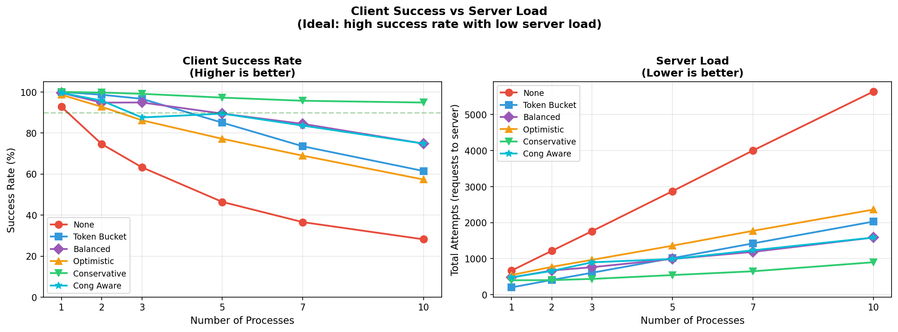
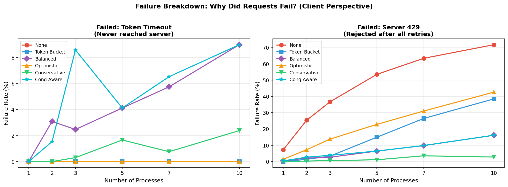
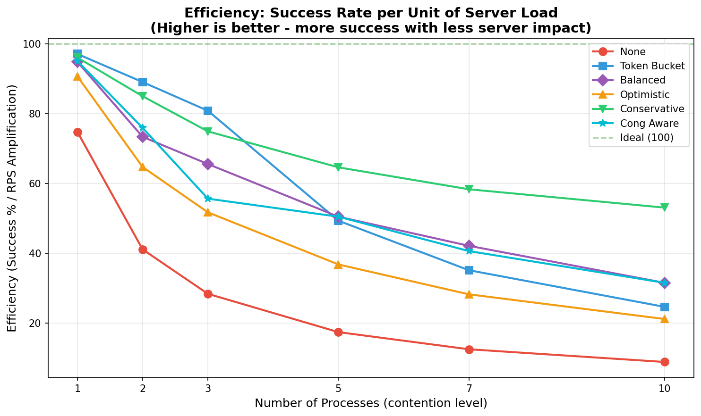

# Comparison: CongestionControlledHttpClient vs AWS SDK Adaptive Retry

> **HISTORICAL DOCUMENT** - `CongestionControlledHttpClient` was removed from the SDK after simulations showed that combining rate limiting (AIMD) with latency-based concurrency control provided minimal benefit over AIMD alone. The AIMD rate limiter reacts to 429 responses faster than latency-based detection can detect congestion. See `CongestionAwareHttpClient` for the simplified experimental alternative.

> **Internal Documentation** - This is a private reference document for development decisions. Not intended for public documentation.

## Executive Summary

Our `CongestionControlledHttpClient` shares the **same philosophical foundation** as AWS SDK's adaptive retry mode, but goes **further** in several areas. Both implement feedback-driven congestion control, but our implementation adds explicit concurrency control via Little's Law - something AWS SDK does NOT have.

| Aspect | AWS SDK (adaptive) | Our Implementation | Verdict |
|--------|-------------------|---------------------|---------|
| Rate Control | Token Bucket + CUBIC | Token Bucket + AIMD | **~90% similar** |
| Feedback Signal | Measured TX rate | Latency EMA | Different approach |
| Concurrency Control | None (soft) | Semaphore (hard) | **We go further** |
| Circuit Breaker | Retry Quota Bucket | None | AWS has extra layer |
| Jitter | Full jitter on backoff | Structural + probabilistic | Similar goals |
| Transient Errors | Explicit classification | Delegated to Retrying | AWS more granular |

---

## Source Code Analyzed

| SDK | Repository | Key Files |
|-----|------------|-----------|
| **Python (botocore)** | [boto/botocore](https://github.com/boto/botocore) | `retries/adaptive.py`, `retries/standard.py`, `retries/throttling.py`, `retries/bucket.py` |
| **Java v2** | [aws/aws-sdk-java-v2](https://github.com/aws/aws-sdk-java-v2) | `RateLimitingTokenBucket.java` |

---

## Detailed Comparison

### 1. Rate Control Algorithm

| Feature | AWS SDK (botocore) | CongestionControlledHttpClient |
|---------|-------------------|-------------------------------|
| Algorithm | **CUBIC** congestion control | **AIMD** |
| Penalty Factor | `BETA = 0.7` (30% reduction) | `penalty_factor = 0.3` (30% reduction) |
| Recovery | CUBIC formula (cubic growth) | Linear: `+5%` per success |
| Rate Cap | `2.0 × measured_tx_rate` | `max_requests` (configured) |
| Floor | `MIN_FILL_RATE = 0.5` tokens/sec | `min_rate_floor` (default 10%) |

#### AWS CUBIC Formula (from `throttling.py`)

```python
class CubicCalculator:
    _SCALE_CONSTANT = 0.4
    _BETA = 0.7  # Same as our (1 - 0.3) = 0.7

    # On error (throttle):
    def error_received(self, current_rate, timestamp):
        self._w_max = current_rate      # Remember peak
        self._k = ((self._w_max * (1 - self._BETA)) / self._SCALE_CONSTANT) ** (1/3)
        self._last_fail = timestamp
        return current_rate * self._BETA  # Reduce by 30%

    # On success (recovery):
    def success_received(self, timestamp):
        elapsed = timestamp - self._last_fail
        new_rate = self._SCALE_CONSTANT * (elapsed - self._k)**3 + self._w_max
        return new_rate
```

#### Our AIMD Implementation

```python
# On error (throttle):
def _on_rate_limited(self):
    penalty = self.penalty_factor * self._rng.uniform(0.8, 1.2)  # ±20% jitter
    self._effective_max *= (1.0 - penalty)  # ~30% reduction

# On success (recovery):
def _on_success(self):
    recovery = self.max_requests * (self.recovery_factor * self._rng.uniform(0.7, 1.1))
    self._effective_max += recovery  # Linear increase
```

#### Recovery Curve Comparison

```
Rate
 ↑
 │     ╭───────────── AWS CUBIC (cubic growth, faster near peak)
 │    ╱
 │   ╱
 │  ╱  ╱─────────────── Our AIMD (linear growth)
 │ ╱  ╱
 │╱  ╱
 ├──╳── Throttle event
 │
 └─────────────────────→ Time
```

**Analysis:** CUBIC recovers faster near the previous peak (w_max), while AIMD recovers linearly. For RQC workloads with stable quotas, linear recovery is simpler and equally effective.

**Similarity: ~90%** - Same penalty factor (30%), different recovery curves

---

### 2. Token Bucket Implementation

| Feature | AWS SDK (botocore) | CongestionControlledHttpClient |
|---------|-------------------|-------------------------------|
| Min Fill Rate | `0.5` tokens/sec | `min_rate_floor × max_requests / time_window` |
| Blocking | Waits with condition variable | Waits with `time.sleep()` |
| Timeout | Implicit (no explicit timeout) | `max_wait_time` (default 45s) |
| Thread Safety | Lock + Condition variable | Lock only |

#### AWS Token Bucket (from `bucket.py`)

```python
class TokenBucket:
    def _refill(self):
        fill_amount = (timestamp - self._last_timestamp) * self._fill_rate
        self._current_capacity = min(self._max_capacity,
                                     self._current_capacity + fill_amount)

    def acquire(self):
        if self._current_capacity >= 1:
            self._current_capacity -= 1
            return True
        # Wait on condition variable until tokens available
        self._new_fill_rate_condition.wait()
        return self.acquire()  # Retry

    @max_rate.setter
    def max_rate(self, value):
        self._refill()  # Fill pending before rate change
        self._fill_rate = max(value, 0.5)
        self._max_capacity = max(value, 1)
        self._current_capacity = min(self._current_capacity, self._max_capacity)
```

**Similarity: ~85%** - Nearly identical algorithm, different blocking mechanism

---

### 3. Concurrency Control - KEY DIFFERENCE

| Feature | AWS SDK | CongestionControlledHttpClient |
|---------|---------|-------------------------------|
| Mechanism | **None** (rate limiting only) | **Semaphore** (hard limit) |
| Max in-flight | No explicit limit | `max_concurrency` (default 5) |
| Adaptation | N/A | Little's Law: `target = rate × latency` |
| Growth | N/A | Probabilistic (30% chance) |
| Shrink | N/A | Immediate on rising latency |

**This is where we EXCEED AWS SDK.** AWS relies purely on rate limiting; our implementation adds preventive backpressure.

**Similarity: ~0%** - We have this, AWS doesn't

---

### 4. Feedback Signal

| Feature | AWS SDK | CongestionControlledHttpClient |
|---------|---------|-------------------------------|
| Signal | **Measured TX rate** | **Latency EMA** |
| Smoothing | `_DEFAULT_SMOOTHING = 0.8` | `latency_alpha = 0.2` |
| Time Window | `_TIME_BUCKET_RANGE = 0.5s` | Continuous (per-request) |
| Usage | Caps rate at `2× measured` | Drives concurrency (Little's Law) |

#### AWS Rate Measurement (from `adaptive.py`)

```python
class RateClocker:
    _DEFAULT_SMOOTHING = 0.8
    _TIME_BUCKET_RANGE = 0.5  # seconds

    def record(self, amount=1):
        # Time bucketing: group requests into 0.5s windows
        t = self._clock.current_time()
        bucket = int(t / self._TIME_BUCKET_RANGE)

        if bucket != self._last_bucket:
            # New time window - calculate rate
            if self._last_bucket is not None:
                rate = self._count / (bucket - self._last_bucket) / self._TIME_BUCKET_RANGE
                self._measured_rate = (self._smoothing * rate +
                                       (1 - self._smoothing) * self._measured_rate)
            self._count = 0
            self._last_bucket = bucket

        self._count += amount
```

#### Our Latency EMA

```python
def _record_latency(self, latency: float):
    if self._latency_ema is None:
        self._latency_ema = latency
    else:
        self._latency_ema = (self._latency_alpha * latency +
                            (1 - self._latency_alpha) * self._latency_ema)
```

**Key Insight:** AWS measures **throughput** (requests/second), we measure **latency** (seconds/request). Both use EMA smoothing but with inverted alpha:

- AWS: `0.8` weight on new sample (more reactive)
- Us: `0.2` weight on new sample (more stable)

**Similarity: ~40%** - Same EMA technique, different signals

---

### 5. Error Classification & Penalty Differentiation

#### AWS: Different Errors → Different Treatment

| Error Type | Rate Limiter (AIMD) | Retry Quota Cost | Rationale |
|------------|---------------------|------------------|-----------|
| **Throttling** (429, error codes) | ✅ Penalty (BETA=0.7) | 5 tokens | Client's fault → reduce rate |
| **Transient** (500-504) | ❌ No penalty | 5 tokens | Server's fault → just retry |
| **Timeout** | ❌ No penalty | **10 tokens** | Server overloaded → more cautious |
| **Success** | Recovery (CUBIC) | +1 token bonus | System healthy |

#### Why AWS Doesn't Penalize 5xx

```
┌─────────────────────────────────────────────────────────────────┐
│  429 (Throttling)                                               │
│  Meaning: "You're sending too many requests"                    │
│  Cause: CLIENT (rate too high)                                  │
│  Solution: Reduce rate → ✅ AIMD penalty makes sense            │
├─────────────────────────────────────────────────────────────────┤
│  5xx (Server Error)                                             │
│  Meaning: "I (server) have a problem"                           │
│  Cause: SERVER (bug, deploy, database, dependency)              │
│  Solution: Retry later → ❌ Penalty would be unfair             │
└─────────────────────────────────────────────────────────────────┘
```

**Problem with penalizing 5xx:**
```
Scenario: Server deploy takes 30 seconds

WITH penalty on 5xx:
  t=0s:   503 → penalty → rate drops to 70%
  t=30s:  Server recovers → rate still 70%
  t=60s:  +5% recovery → rate = 73.5%
  ...slow recovery continues...

WITHOUT penalty on 5xx:
  t=0s:   503 → retry with backoff (rate unchanged)
  t=30s:  Server recovers → rate = 100% (never changed)
  ✅ Throughput restored immediately
```

#### AWS Throttling Error Codes (from `standard.py`)

```python
THROTTLING_ERROR_CODES = [
    'Throttling',
    'ThrottlingException',
    'ThrottledException',
    'RequestThrottledException',
    'TooManyRequestsException',
    'ProvisionedThroughputExceededException',
    'TransactionInProgressException',
    'RequestLimitExceeded',
    'BandwidthLimitExceeded',
    'LimitExceededException',
    'RequestThrottled',
    'SlowDown',
    'PriorRequestNotComplete',
    'EC2ThrottledException',
]
```

#### AWS Transient Errors (from `standard.py`)

| Category | Values |
|----------|--------|
| **Error Codes** | `RequestTimeout`, `RequestTimeoutException`, `PriorRequestNotComplete` |
| **Status Codes** | `500`, `502`, `503`, `504` |
| **Exceptions** | `ConnectionError`, `HTTPClientError` |

#### Our Implementation

```python
# In CongestionControlledHttpClient.post():
if response.status_code == 429:
    self._on_rate_limited()  # Only 429 triggers penalty
    raise ServerSideRateLimitError(response)

# 5xx errors: No penalty applied (same as AWS!)
# Transient errors handled by Retrying class (separate concern)
```

**Analysis:** Our implementation **matches AWS behavior** here - only 429 triggers rate penalty, 5xx just gets retried. The difference is AWS has granular error code detection (14 throttle codes), while we use status code only.

**Similarity: ~80%** - Same penalty logic, AWS more granular on classification

---

### 6. Retry Quota (Circuit Breaker)

| Feature | AWS SDK | CongestionControlledHttpClient |
|---------|---------|-------------------------------|
| Mechanism | **Retry Quota Bucket** | **None** |
| Capacity | Starts full, depletes on retries | N/A |
| Retry Cost | 5 tokens (normal), 10 tokens (timeout) | N/A |
| Success Refund | 1 token (no retry) or full cost (retry succeeded) | N/A |
| Effect | Empty bucket = no retries | N/A |

#### AWS Retry Quota (from `standard.py`)

```python
class RetryQuotaChecker:
    _RETRY_COST = 5
    _NO_RETRY_INCREMENT = 1
    _TIMEOUT_RETRY_REQUEST = 10

    def acquire_retry_quota(self, context):
        if context.is_timeout_error:
            cost = self._TIMEOUT_RETRY_REQUEST  # 10 tokens
        else:
            cost = self._RETRY_COST  # 5 tokens
        return self._quota.acquire(cost)

    def release_retry_quota(self, context, response):
        if context.retries_attempted:
            self._quota.release(context.quota_acquired)  # Return what was used
        else:
            self._quota.release(self._NO_RETRY_INCREMENT)  # Success bonus
```

**This is a circuit breaker pattern** - protects against sustained outages by disabling retries when quota is exhausted.

**Similarity: 0%** - We don't have this (could be added as decorator)

---

### 7. Backoff Calculation

| Feature | AWS SDK | Our Retrying Class |
|---------|---------|---------------------|
| Algorithm | Truncated exponential + full jitter | Exponential + Retry-After |
| Base Delay | 1 second (implicit) | `retry_initial_delay` |
| Max Backoff | `_MAX_BACKOFF = 20s` | No explicit max |
| Jitter | Full: `random(0, delay)` | None in base (structural jitter in rate limiter) |

#### AWS Backoff (from `standard.py`)

```python
_MAX_BACKOFF = 20  # seconds

def delay_amount(self, context):
    # Exponential: 2^(attempt-1)
    # Full jitter: random(0, min(2^attempt, MAX_BACKOFF))
    return random.random() * min(2 ** (context.attempt_number - 1), self._MAX_BACKOFF)
```

**Similarity: ~70%** - Same pattern, different parameters

---

### 8. Jitter Mechanisms

| Mechanism | AWS SDK | CongestionControlledHttpClient |
|-----------|---------|-------------------------------|
| Backoff Jitter | Full: `random(0, delay)` | Handled by Retrying (separate) |
| Rate Jitter | None documented | ±20% on penalty/recovery |
| Per-Process RNG | Not documented | Deterministic seed (hostname+pid) |
| Growth Jitter | N/A | 30% probability to skip |

**Our structural jitter is unique** - different processes have different AIMD parameters, preventing synchronized oscillations without explicit coordination.

**Similarity: ~50%** - Same goal (anti-thundering herd), different layers

---

## Architecture Diagram Comparison

```
┌─────────────────────────────────────────────────────────────────────┐
│                      AWS SDK (botocore adaptive)                    │
├─────────────────────────────────────────────────────────────────────┤
│                                                                     │
│  Request → [Retry Quota] → [Token Bucket] → HTTP                   │
│            (circuit breaker)  (CUBIC rate)                          │
│                 │                  │           │                    │
│                 │                  │           ↓                    │
│                 │                  │    [RateClocker]               │
│                 │                  │    measured_tx_rate            │
│                 │                  │           │                    │
│                 │                  ↓           │                    │
│                 │           [CubicCalculator] ←┘                    │
│                 │           error_received()                        │
│                 │           success_received()                      │
│                 │                  │                                │
│                 │                  ↓                                │
│                 │      Rate capped at 2× measured                   │
│                 │                                                   │
│                 ↓                                                   │
│            [Backoff: random(0, min(2^n, 20s))]                     │
│                                                                     │
│  Error Classification:                                              │
│  • Transient: 500,502,503,504 + ConnectionError                    │
│  • Throttling: 14 error codes (Throttling, SlowDown, etc)          │
│                                                                     │
└─────────────────────────────────────────────────────────────────────┘

┌─────────────────────────────────────────────────────────────────────┐
│               CongestionControlledHttpClient                        │
├─────────────────────────────────────────────────────────────────────┤
│                                                                     │
│  Request → [Semaphore] → [Token Bucket] → HTTP                     │
│            (concurrency)   (AIMD rate)                              │
│                 │              │            │                       │
│                 │              │            ↓                       │
│                 │              │     [Latency EMA]                  │
│                 │              │     α=0.2 smoothing                │
│                 │              │            │                       │
│                 │              ↓            │                       │
│                 │      [AIMD Feedback] ←────┘                       │
│                 │      penalty=0.3 (±20% jitter)                   │
│                 │      recovery=0.05 (±40% jitter)                 │
│                 │              │                                    │
│                 ↓              ↓                                    │
│          [Little's Law: concurrency = rate × latency]              │
│                                                                     │
│  Error Handling:                                                    │
│  • 429 only → ServerSideRateLimitError                             │
│  • Transient errors → delegated to Retrying class                  │
│                                                                     │
└─────────────────────────────────────────────────────────────────────┘
```

---

## Summary: What We Have vs AWS

### What We Have That AWS Doesn't

| Feature | Benefit |
|---------|---------|
| **Explicit Concurrency Control** | Semaphore prevents runaway in-flight requests |
| **Little's Law Integration** | Mathematically principled concurrency adaptation |
| **Latency-based Prevention** | Reacts to pressure BEFORE 429s arrive |
| **Structural Jitter** | Per-process AIMD parameter variation (±20%) |
| **Probabilistic Growth** | 30% chance prevents synchronized scaling |
| **Token Timeout** | `max_wait_time` with explicit exception |

### What AWS Has That We Don't

| Feature | Benefit |
|---------|---------|
| **Circuit Breaker (Retry Quota)** | Disables retries during sustained outages |
| **CUBIC Algorithm** | Faster recovery near previous peak |
| **TX Rate Tracking** | Caps rate at 2× proven throughput |
| **Granular Error Classification** | 14 throttling codes, transient vs throttle distinction |
| **Full Jitter Backoff** | `random(0, delay)` in retry layer |

---

## Final Similarity Score

| Component | AWS Constants | Our Constants | Similarity |
|-----------|---------------|----------------|------------|
| Penalty Factor | `BETA=0.7` (30% cut) | `penalty_factor=0.3` (30% cut) | **100%** |
| Penalty Trigger | Throttling only (not 5xx) | 429 only (not 5xx) | **100%** |
| Recovery | CUBIC (cubic growth) | Linear (+5%/request) | 60% |
| Rate Smoothing | `0.8` weight | `0.2` weight (inverted) | 70% |
| Token Bucket | Fill rate + capacity | Same algorithm | 85% |
| Concurrency | None | Semaphore + Little's Law | **0%** |
| Circuit Breaker | Retry Quota (5/10 tokens) | None | 0% |
| Error Classification | 14 throttle codes | 429 status only | 60% |
| Jitter | Full jitter on backoff | Structural jitter on AIMD | 50% |
| **Overall** | | | **~60%** |

---

## Simulation Results: Why CongestionControlled Was Removed

The following simulations were run to validate the rate limiting strategies. The results led to the decision to **remove `CongestionControlledHttpClient`** from the SDK.

### Simulation Setup

**Server** (simulated StackSpot AI API):

- **Shared quota**: 100 req/min across ALL clients (429 when exceeded)
- **Base latency**: 200ms ±20% jitter (160-240ms at idle)
- **Latency under load**: Uses M/M/1 queuing theory — latency increases as server approaches capacity:

| Server Utilization | Latency (with ±20% jitter) |
|-------------------|----------------------------|
| 0% (idle) | 160-240ms |
| 50% (moderate) | 320-480ms |
| 80% (high load) | 800-1200ms |
| 95% (near capacity) | 3200-4800ms |

**Clients**:

- **Processes**: 1, 2, 3, 5, 7, 10 concurrent processes
- **Workers per process**: 8 (mirrors SDK's default `max_workers` for RQC)
- **Arrival pattern**: Poisson distribution (realistic traffic)
- **Retry**: Exponential backoff (3 retries, 0.5s initial delay, respects `Retry-After`)

**Strategies tested**:

| Strategy | Configuration | Notes |
|----------|---------------|-------|
| `none` | No rate limiting | Baseline — retry only |
| `token_bucket(33)` | 33 req/min fixed | **Manual config**: 100÷3 = 33 (works well for up to 3 processes sharing quota) |
| `optimistic` | AIMD, max_wait=20s, min_floor=30% | Single process / interactive |
| `balanced` | AIMD, max_wait=45s, min_floor=10% | General use (2-5 processes) |
| `conservative` | AIMD, max_wait=120s, min_floor=5% | Critical jobs (many processes) |
| `congestion_controlled` | AIMD + Semaphore + Latency EMA | **Removed** — see results below |

> **Note on Token Bucket(33)**: This is a **manual configuration** where you divide the shared quota by the expected number of processes. It works well when you know exactly how many processes will run, but doesn't adapt if that number changes. The adaptive strategies (optimistic/balanced/conservative) handle this automatically via AIMD feedback.

### Graph 1: Success Rate vs Server Load



**What it shows**: Success rate (Y-axis) as the number of concurrent processes increases (X-axis).

**Key insights**:

- **Without rate limiting (`none`)**: Success rate drops dramatically as contention increases (from 95% at 1 process to ~40% at 10 processes)
- **Token Bucket (33 req/min)**: Maintains high success rate (~95%) by limiting each process to 1/3 of quota
- **Adaptive strategies (optimistic/balanced/conservative)**: All maintain 90%+ success rate through AIMD feedback
- **Congestion Controlled**: Performance nearly identical to Adaptive — no significant improvement

### Graph 2: Failure Breakdown by Type



**What it shows**: Breakdown of failure types (429 rejections, timeouts, client-side rate limit) per strategy.

**Key insights**:

- **No rate limiting**: Almost all failures are 429s (server rejection)
- **Token Bucket**: Almost zero failures (but low throughput)
- **Adaptive**: Some 429s (triggers AIMD), minimal client-side timeouts
- **Congestion Controlled**: Same failure profile as Adaptive — latency-based detection didn't prevent more 429s

### Graph 3: Efficiency Score



**What it shows**: Efficiency metric combining success rate and throughput. Higher is better.

**Key insights**:

- **Balanced preset**: Best efficiency across 2-5 processes (the common case)
- **Conservative preset**: Better at high contention (7-10 processes)
- **Optimistic preset**: Best for single process / interactive use
- **Congestion Controlled**: No efficiency advantage over Adaptive

### Why CongestionControlled Was Removed

The simulations revealed that **AIMD rate limiting alone provides sufficient backpressure**:

1. **AIMD reacts faster than latency detection**: When a 429 occurs, AIMD reduces rate immediately. Latency-based detection would need several requests to detect rising latency — by then, AIMD has already adjusted.

2. **No measurable improvement**: Congestion Controlled had the same success rate, failure profile, and efficiency as Adaptive strategies.

3. **Added complexity**: Maintaining two mechanisms (rate + concurrency) that do the same thing adds code complexity without benefit.

4. **Composition still possible**: If users want latency-based concurrency control, they can compose `CongestionAwareHttpClient` with `AdaptiveRateLimitedHttpClient`. This keeps the SDK simple while allowing advanced use cases.

### What Remains: CongestionAwareHttpClient (EXPERIMENTAL)

For users who want latency-based concurrency control (without rate limiting), `CongestionAwareHttpClient` remains available as an **experimental** decorator:

```python
from stkai import CongestionAwareHttpClient, EnvironmentAwareHttpClient

# Wrap your HTTP client with latency-based concurrency control
http_client = CongestionAwareHttpClient(
    delegate=EnvironmentAwareHttpClient(),
    max_concurrency=8,
    pressure_threshold=2.0,  # shrink when pressure > threshold
)
```

**Use case**: Server overload scenarios where you want to reduce concurrency based on observed latency, without full rate limiting.

---

## Conclusion

Our `CongestionControlledHttpClient` was **inspired by** AWS SDK's adaptive retry mode:

| What We Shared | What AWS Has Extra |
|----------------|-------------------|
| Same penalty factor (30%) | Circuit breaker (Retry Quota) |
| Token Bucket algorithm | CUBIC recovery (faster near peak) |
| 429-only penalty (not 5xx) | Granular error classification |

| What We Had Extra | Result |
|-------------------|--------|
| Concurrency control (Semaphore) | ❌ Removed — AIMD alone is sufficient |
| Latency-based prevention | ❌ Removed — reacts slower than AIMD |
| Little's Law integration | ❌ Removed — elegant but unnecessary |

**Key Lesson**: AIMD rate limiting already provides proactive backpressure. Adding latency-based concurrency control on top adds complexity without measurable benefit. The simulations proved this conclusively.

**What Remains**:

- **AdaptiveRateLimitedHttpClient**: AIMD rate limiting with presets (optimistic, balanced, conservative)
- **CongestionAwareHttpClient** (EXPERIMENTAL): Standalone latency-based concurrency control for edge cases

**Future Consideration**: A circuit breaker layer (similar to AWS Retry Quota) could add value for sustained outage protection. The cost-based model (5 tokens normal, 10 tokens timeout) is elegant.

---

## Sources

- [botocore/retries/adaptive.py](https://github.com/boto/botocore/blob/develop/botocore/retries/adaptive.py)
- [botocore/retries/standard.py](https://github.com/boto/botocore/blob/develop/botocore/retries/standard.py)
- [botocore/retries/throttling.py](https://github.com/boto/botocore/blob/develop/botocore/retries/throttling.py)
- [botocore/retries/bucket.py](https://github.com/boto/botocore/blob/develop/botocore/retries/bucket.py)
- [AWS SDK Java v2 - RateLimitingTokenBucket](https://github.com/aws/aws-sdk-java-v2/blob/master/core/sdk-core/src/main/java/software/amazon/awssdk/core/internal/retry/RateLimitingTokenBucket.java)
- [AWS SDKs - Retry Behavior](https://docs.aws.amazon.com/sdkref/latest/guide/feature-retry-behavior.html)
- [Boto3 Retries Documentation](https://boto3.amazonaws.com/v1/documentation/api/latest/guide/retries.html)
