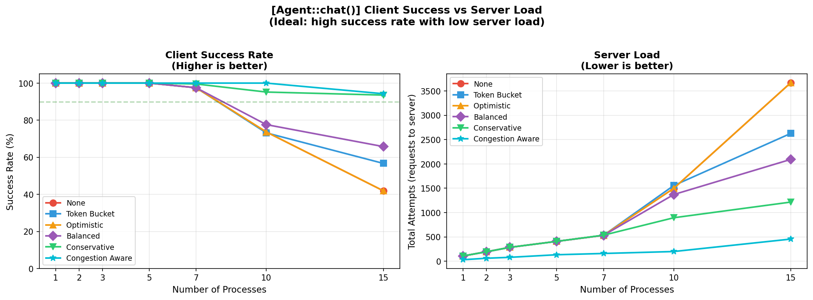
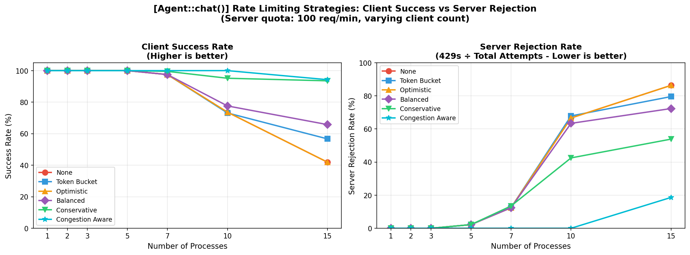
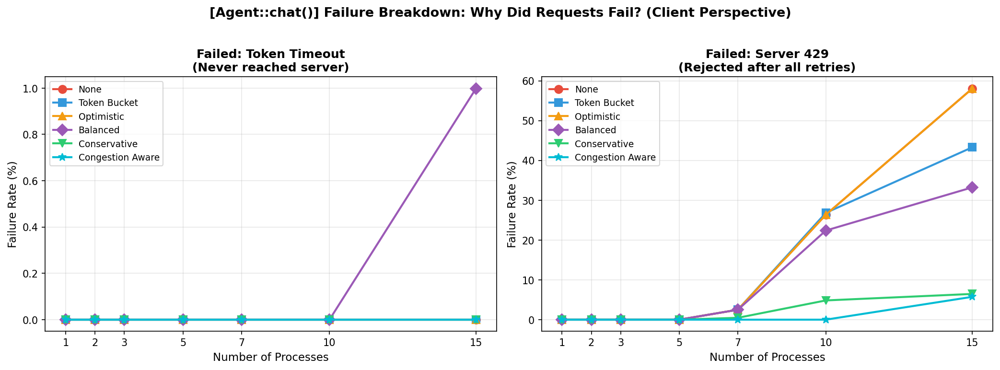
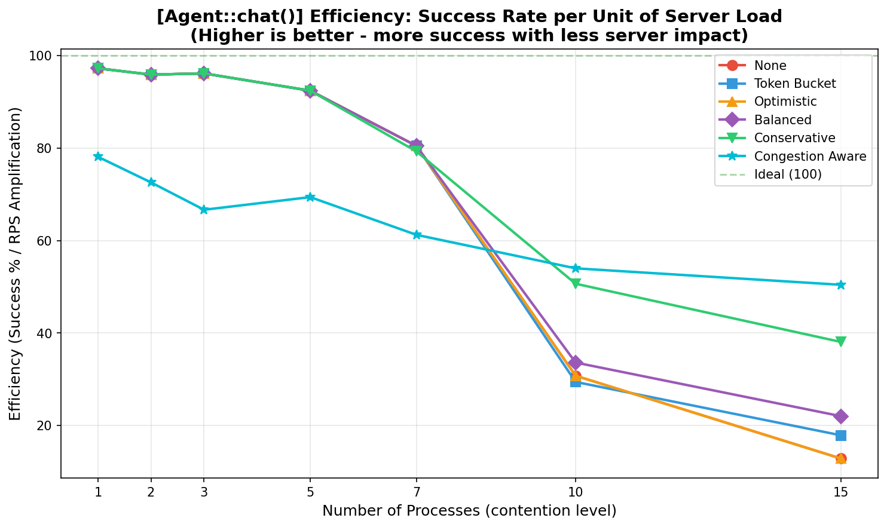
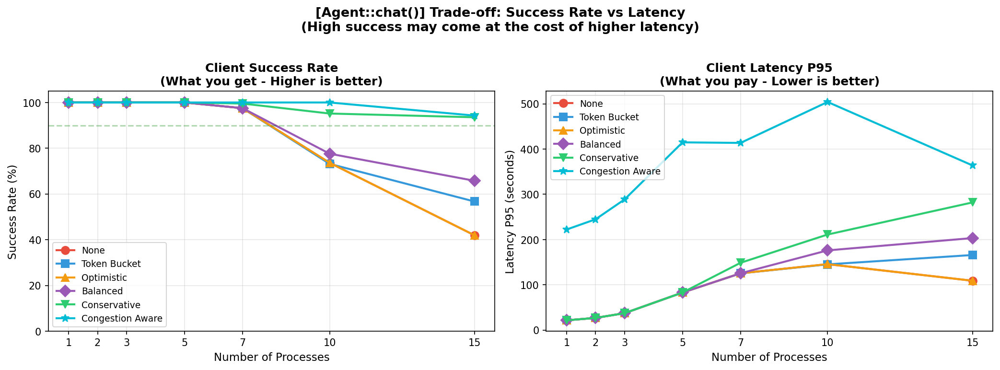

# Agent Rate Limiting Simulation Results

**Generated:** 2026-02-09 (updated with ±20% latency jitter)

These graphs were generated using discrete-event simulations (SimPy) to validate the SDK's rate limiting strategies for Agent workloads under various contention levels.

> **Note: Agent-Specific Reference Graphs**
>
> These reference graphs are for **Agent::chat()** workloads:
>
> | Workload | POST Latency | Reference Graphs |
> |----------|--------------|------------------|
> | **RQC** | ~200ms (submit) + polling | See `rqc/reference/` |
> | **Agent::chat()** | ~15s (LLM processing) | Here (`agent/reference/`) |
>
> **Key difference**: Agent's long latency (~15s) naturally limits throughput to ~4 req/min per worker. Rate limiting has minimal impact until 7+ concurrent processes.

> **Disclaimer: Simulation Limitations**
>
> These simulations are useful for **relative comparisons** between strategies, but do not perfectly model real-world conditions. Key limitations:
>
> - **Simplified latency model**: M/M/1 queuing assumes exponential service times; real LLM inference may have different distributions (e.g., bimodal due to cache hits/misses)
> - **No network effects**: DNS resolution, TLS handshakes, TCP congestion, packet loss, and jitter are not modeled
> - **No server variability**: GC pauses, cold starts, connection pooling, and load balancer behavior are not simulated
> - **Perfect clocks**: No clock skew between client and server
> - **Binary failures**: Server returns 200 or 429 only; real systems have timeouts, 5xx errors, partial failures
>
> **Use these results to**: build intuition, compare strategies, validate algorithm correctness.
>
> **Do not use to**: predict exact production metrics or skip real-world testing.

## Simulation Setup

**Server (simulated StackSpot AI API):**

- **Shared quota:** 50 req/min across ALL clients (429 when exceeded)
- **Base latency:** 15s ±20% jitter (12-18s at idle)
- **Latency under load:** M/M/1 queuing theory — latency increases with utilization:

| Server Utilization | Latency (with ±20% jitter) |
|-------------------|----------------------------|
| 0% (idle) | 12-18s |
| 50% (moderate) | 24-36s |
| 80% (high load) | 60-90s |
| 95% (near capacity) | 240-360s |

**Clients:**

- **Processes:** 1, 2, 3, 5, 7, 10, 15 concurrent processes
- **Workers per process:** 10 (simulates multiple users per application)
- **Requests per process:** 150
- **Duration:** 600s (10 minutes)
- **Arrival pattern:** Poisson distribution (realistic traffic)
- **Retry:** Exponential backoff (3 retries, 0.5s initial delay, respects `Retry-After`)

## Strategies Tested

| Strategy | Algorithm | Configuration | Best For |
|----------|-----------|---------------|----------|
| `none` | No rate limiting | Retry only | Baseline comparison |
| `token_bucket` | Fixed rate | 16 req/min (50÷3 for 3 processes) | Known process count |
| `optimistic` | AIMD | max_wait=20s, penalty=15%, floor=30% | Single process / interactive |
| `balanced` | AIMD | max_wait=45s, penalty=30%, floor=10% | General use (2-5 processes) |
| `conservative` | AIMD | max_wait=120s, penalty=50%, floor=5% | High contention (7+ processes) |
| `congestion_aware` | AIMD + Little's Law | Same as balanced + pressure_threshold=2.0 | Experimental |

---

## Graph 1: Success Rate vs Server Load



**What it shows:** Success rate (Y-axis) as the number of concurrent processes increases (X-axis).

**Key observations:**

- **All strategies perform identically until 7 processes** — long latency naturally limits throughput
- **Conservative:** Best at high contention — 91.4% success at 15 processes
- **Congestion Aware:** Similar to Conservative — 93.1% at 15 processes
- **Balanced:** Moderate — 65.2% at 15 processes
- **Token Bucket (16):** 56.6% at 15 processes
- **None/Optimistic:** Worst — ~41% at 15 processes

---

## Graph 2: Success Rate vs Rejection Rate



**What it shows:** Trade-off between client success rate and server rejection rate (429s).

**Key observations:**

- **Conservative** achieves high success with low 429 rate
- **Congestion Aware** achieves highest success but with semaphore blocking
- At low contention (1-5 processes), all strategies cluster together

---

## Graph 3: Failure Breakdown



**What it shows:** Types of failures per strategy — 429 rejections vs client-side timeouts.

**Key observations:**

- **Balanced** shows client-side timeouts at high contention (45s max_wait exceeded)
- **Conservative** has minimal timeouts despite heavy throttling (120s max_wait)
- **No rate limiting** shows mostly 429s (server rejection)

---

## Graph 4: Efficiency Score



**What it shows:** Efficiency metric combining success rate and throughput. Higher is better.

**Key observations:**

- **All strategies are nearly identical until 7 processes** (latency is the bottleneck)
- **Conservative:** Best efficiency at 10-15 processes
- **Congestion Aware:** High success but lower throughput (semaphore blocking)

---

## Graph 5: Success Rate vs Latency



**What it shows:** How P95 latency correlates with success rate across strategies.

**Key observations:**

- Higher latency generally correlates with lower success (contention effects)
- **Conservative** trades higher latency for better success rate

---

## Key Insights

### 1. Long latency is a natural rate limiter

With 15s per request, each worker can only do ~4 req/min. This naturally limits throughput and means rate limiting has minimal impact until 7+ concurrent processes.

### 2. Rate limiting matters only at high contention

| Processes | Rate Limiting Impact |
|-----------|---------------------|
| 1-5 | Minimal — all strategies ~equal |
| 7-10 | Moderate — conservative starts to excel |
| 15+ | Significant — conservative 91% vs none 42% |

### 3. Choose preset by contention level

| Scenario | Recommended Preset |
|----------|-------------------|
| Single process / interactive | Any (latency-limited) |
| 2-5 concurrent processes | `balanced` |
| 7+ processes / production clusters | `conservative` |

### 4. Token Bucket needs proper tuning

Token Bucket at 16 req/min (50÷3) shows improvement at high contention (56.6% vs 41.9% for none), but AIMD presets adapt better.

### 5. Congestion Aware achieves high success but low throughput

The semaphore-based concurrency control achieves 93.1% success but completes fewer total requests due to blocking. Use only if success rate matters more than throughput.

---

## RQC vs Agent Comparison

| Aspect | RQC | Agent |
|--------|-----|-------|
| Natural throughput/worker | ~300 req/min | ~4 req/min |
| Rate limiting critical? | **Yes** | Only at 7+ processes |
| Token Bucket effective? | **Yes** (limits 300→33) | Limited (4 < 16) |
| Best strategy (general) | `balanced` | `conservative` |
| Contention threshold | 3+ processes | 7+ processes |

---

## Reproducing These Results

```bash
./scripts/run_simulations.sh agent
```

Results will be saved to `simulations/results/agent/latest/`.

To update reference graphs:
```bash
DATE=$(date +%Y-%m-%d)
for f in simulations/results/agent/latest/graph_*.png; do
  cp "$f" "simulations/results/agent/reference/${DATE}_$(basename $f)"
done
```
