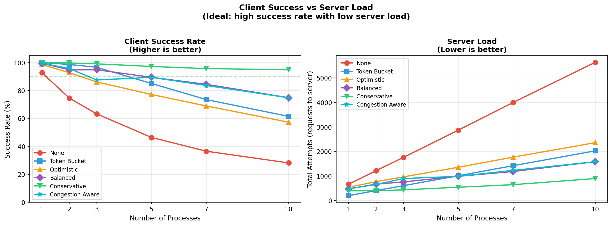
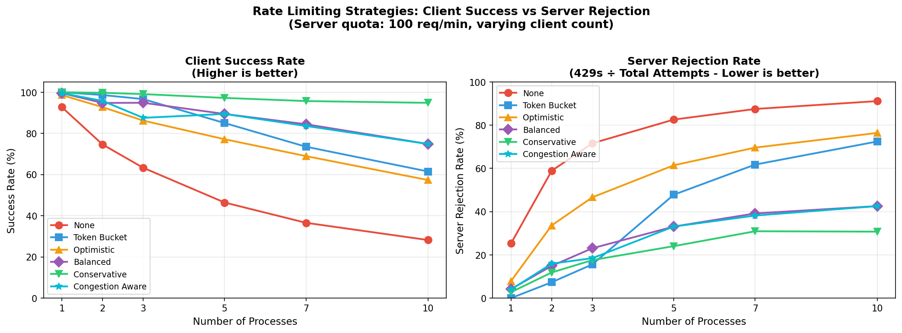
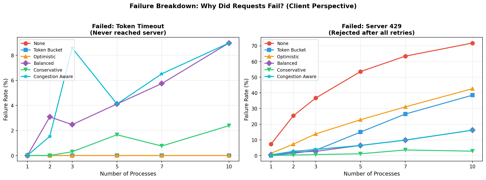
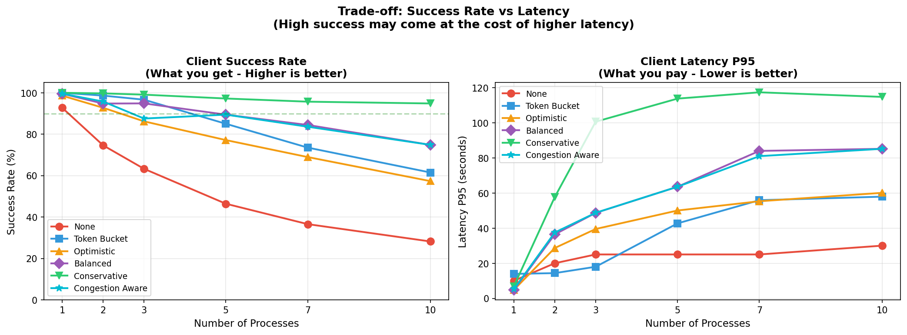

# Rate Limiting Simulation Results

**Generated:** 2026-02-06

These graphs were generated using discrete-event simulations (SimPy) to validate the SDK's rate limiting strategies under various contention levels.

> **Disclaimer: RQC-Specific Simulations**
>
> These simulations model **RQC (Remote Quick Commands)** workloads only:
>
> | Workload | POST Latency | Simulated? |
> |----------|--------------|------------|
> | **RQC** | ~200ms (submit) + polling | Yes |
> | **Agent::chat()** | 10-30s (LLM processing) | No |
>
> **Why it matters**: Agent has much longer request times, so fewer requests per minute are possible and concurrency patterns differ significantly. The preset recommendations in this document are optimized for RQC; Agent workloads may behave differently.

> **Disclaimer: Simulation Limitations**
>
> These simulations are useful for **relative comparisons** between strategies, but do not perfectly model real-world conditions. Key limitations:
>
> - **Simplified latency model**: M/M/1 queuing assumes exponential service times; real LLM inference may have different distributions (e.g., bimodal due to cache hits/misses)
> - **No network effects**: DNS resolution, TLS handshakes, TCP congestion, packet loss, and jitter are not modeled
> - **No server variability**: GC pauses, cold starts, connection pooling, and load balancer behavior are not simulated
> - **Perfect clocks**: No clock skew between client and server
> - **Binary failures**: Server returns 200 or 429 only; real systems have timeouts, 5xx errors, partial failures
>
> **Use these results to**: build intuition, compare strategies, validate algorithm correctness.
>
> **Do not use to**: predict exact production metrics or skip real-world testing.

## Simulation Setup

**Server (simulated StackSpot AI API):**

- **Shared quota:** 100 req/min across ALL clients (429 when exceeded)
- **Base latency:** 200ms (RQC POST request at idle server)
- **Latency under load:** M/M/1 queuing theory — latency increases with utilization:

| Server Utilization | Latency |
|-------------------|---------|
| 0% (idle) | 200ms |
| 50% (moderate) | 400ms |
| 80% (high load) | 1000ms |
| 95% (near capacity) | 4000ms |

**Clients:**

- **Processes:** 1, 2, 3, 5, 7, 10 concurrent processes
- **Workers per process:** 8 (mirrors SDK's default `max_workers` for RQC)
- **Arrival pattern:** Poisson distribution (realistic traffic)
- **Retry:** Exponential backoff (3 retries, 0.5s initial delay, respects `Retry-After`)

## Strategies Tested

| Strategy | Algorithm | Configuration | Best For |
|----------|-----------|---------------|----------|
| `none` | No rate limiting | Retry only | Baseline comparison |
| `token_bucket` | Fixed rate | 33 req/min (100÷3 for 3 processes) | Known process count |
| `optimistic` | AIMD | max_wait=20s, penalty=15%, floor=30% | Single process / interactive |
| `balanced` | AIMD | max_wait=45s, penalty=30%, floor=10% | General use (2-5 processes) |
| `conservative` | AIMD | max_wait=120s, penalty=50%, floor=5% | High contention (many processes) |
| `congestion_aware` | AIMD + Little's Law | Same as balanced + pressure_threshold=2.0 | Experimental |

---

## Graph 1: Success Rate vs Server Load



**What it shows:** Success rate (Y-axis) as the number of concurrent processes increases (X-axis).

**Key observations:**

- **No rate limiting (`none`):** Success rate drops dramatically — from ~93% (1 process) to ~28% (10 processes)
- **Token Bucket:** Excellent at low contention (100% at 1 proc), but degrades at high contention because it's tuned for 3 processes
- **Conservative:** Best overall stability — maintains ~95% even at 10 processes
- **Balanced:** Good middle ground — ~75% at 10 processes
- **Optimistic:** Trades stability for throughput — drops to ~57% at 10 processes
- **Congestion Aware:** Nearly identical to Balanced — Little's Law adds no measurable benefit

---

## Graph 2: Success Rate vs Rejection Rate



**What it shows:** Trade-off between client success rate and server rejection rate (429s).

**Key observations:**

- **Conservative** achieves high success with low 429 rate — best balance
- **Optimistic** generates many 429s (aggressive approach)
- **No rate limiting** overwhelms the server with 429s

---

## Graph 3: Failure Breakdown



**What it shows:** Types of failures per strategy — 429 rejections vs client-side timeouts.

**Key observations:**

- **No rate limiting:** Almost all failures are 429s (server rejection)
- **Token Bucket:** Zero client-side timeouts (fixed rate never blocks too long)
- **Balanced/Congestion Aware:** Some client-side timeouts at high contention (waiting for tokens)
- **Conservative:** Minimal failures overall, few timeouts despite long max_wait

---

## Graph 4: Efficiency Score


**What it shows:** Efficiency metric combining success rate and throughput. Higher is better.

**Key observations:**

- **Optimistic:** Best efficiency at 1 process (high throughput, low overhead)
- **Balanced:** Best efficiency at 2-5 processes (sweet spot)
- **Conservative:** Best efficiency at 7-10 processes (stability wins)
- **Congestion Aware:** Same as Balanced — no efficiency gain

---

## Graph 5: Success Rate vs Latency



**What it shows:** How P95 latency correlates with success rate across strategies.

**Key observations:**

- Higher latency generally correlates with lower success (contention effects)
- **Conservative** has higher latency (longer waits) but better success
- **Optimistic** has lower latency but worse success at high contention

---

## Key Insights

### 1. AIMD is sufficient

Adaptive strategies (Balanced/Conservative) handle contention well without needing latency-based concurrency control. The `Congestion Aware` strategy (which adds Little's Law pressure detection) performed identically to `Balanced`.

**Why?** AIMD reacts to 429 responses faster than latency-based detection can detect congestion. By the time latency rises, AIMD has already adjusted the rate.

### 2. Choose preset by contention level

| Scenario | Recommended Preset |
|----------|-------------------|
| Single process / interactive | `optimistic` |
| 2-5 concurrent processes | `balanced` |
| 6+ processes / critical jobs | `conservative` |

### 3. Token Bucket requires manual tuning

Token Bucket works well **if you know the process count upfront** (divide quota by process count). But it doesn't adapt dynamically — if a new process joins, all processes suffer.

### 4. No rate limiting is catastrophic

Without rate limiting, success rate drops to ~28% at 10 processes. The retry storm amplifies load (289% more requests than original), making the problem worse.

---

## Important: Decentralized Best-Effort Strategies

All rate limiting strategies in this SDK are **decentralized** — each process operates independently with **minimal or no coordination** between them.

### How it works

- Each process maintains its own local rate limiter state
- No shared state or communication between processes
- AIMD adjusts rate based on local observations (429 responses)
- Jitter (±20%) helps desynchronize processes sharing a quota

### Trade-offs

| Aspect | Decentralized (this SDK) | Centralized (Redis, etc.) |
|--------|--------------------------|---------------------------|
| **Coordination** | None — best effort | Full — precise quota enforcement |
| **Complexity** | Simple — no infrastructure | Complex — requires Redis/DB |
| **Latency** | Zero overhead | Network round-trip per request |
| **Failure mode** | Graceful — continues if others fail | Dependent — fails if Redis fails |
| **Accuracy** | Approximate — processes may overshoot | Exact — global counter |

### When to consider centralized solutions

If your scenario requires **precise quota enforcement** across many processes, consider centralized rate limiting with:

- **Redis** — `INCR` + `EXPIRE` for sliding window, or Redis Cell module
- **Database** — Postgres advisory locks or atomic counters
- **Distributed rate limiters** — Envoy, Kong, or cloud API gateways

**The SDK's decentralized approach is ideal for:**

- Single process applications
- Small clusters (2-5 processes) with shared quotas
- Scenarios where simplicity and resilience matter more than precision

---

## Reproducing These Results

```bash
./scripts/run_simulations.sh
```

Results will be saved to `simulations/results/latest/`.

To update reference graphs:
```bash
DATE=$(date +%Y-%m-%d)
for f in simulations/results/latest/graph_*.png; do
  cp "$f" "simulations/results/reference/${DATE}_$(basename $f)"
done
```
